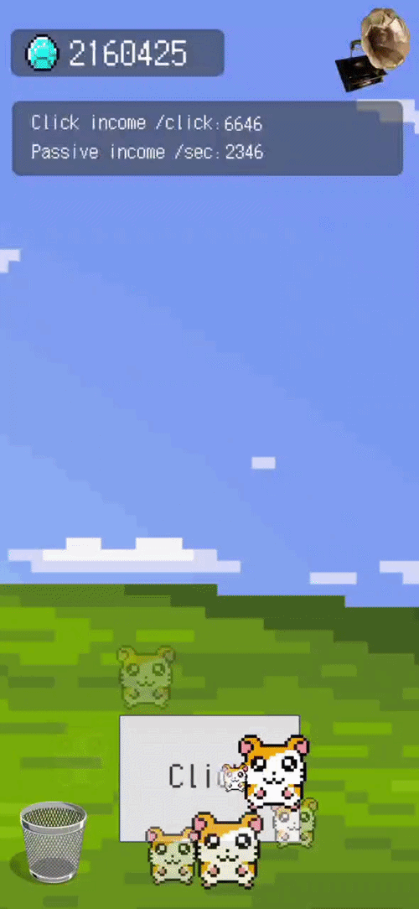
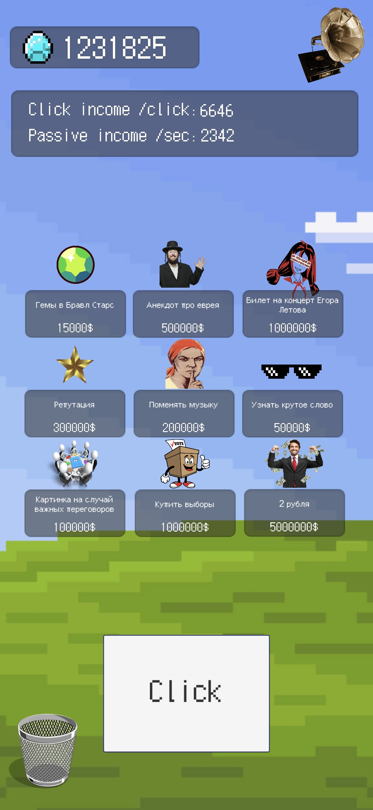
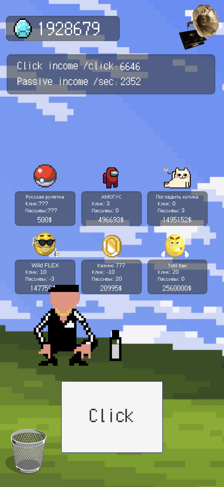
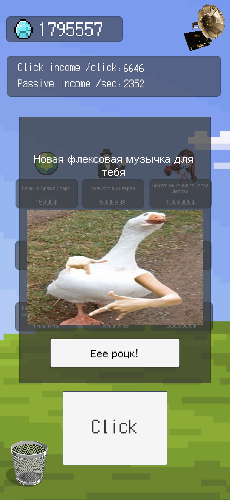

# Deb Click

Жанры: Idle, Clicker

**Скачать:** [DebClick](https://disk.yandex.ru/d/hxfwcIfpmEDHNA)

  

## Описание:
2D-кликер в пиксельном стиле, разработанный в развлекательных целях.
Игрок зарабатывает ресурсы с помощью кликов и может приобретать улучшения, стоимость которых увеличивается по мере прогресса.
Также доступна покупка различных развлекательных элементов Extras(например, смена музыки, купить выборы, купить анекдот и др.), не влияющих напрямую на основной прогресс.
В процессе игры появляются случайные события — персонажи, при взаимодействии с которыми возникают эффекты, связанные с доходом.

  
  
  

## Ключевые особенности:
- Базовая кликер-механика (активный и пассивный доходы)
- Система улучшений с прогрессирующей стоимостью
- Система случайных событий с различными эффектами на доход
- Drag & drop взаимодействие с персонажами случайных событий

## Использованные технологии и подходы:
- Component-based архитектура (логика в компонентах)
- Event-driven взаимодействие между игровыми системами
- ScriptableObjects для хранения данных (улучшения, extras, случайные события, прогресс игрока)
- Object Pooling для VFX эффектов кликов
- Сохранение и загрузка данных (сериализация в JSON и запись в файловую систему)
- Адаптивный UI (поддержка разных экранов вертикальной ориентации)
- Механика пассивного дохода через корутины
- Система случайных событий (с использованием корутин и случайного выбора)
- Использование VFX, Particle System и Animator
- Работа с музыкой(изменение музыки, вкл/выкл)
- Настройка визуального оформления проекта

## Возможные улучшения реализации:
- Изменить механику свайпа (сейчас привязана к абсолютным координатам)
- Разделить логику тайминга появления случайных событий, выбора типа события и спавна объектов
- Добавить всплывающие окна для отображения эффектов от случайных событий
- Реализовать генерацию объектов случайных событий через Pool
- Адаптировать для горизонтальной ориентации
- Реализовать загрузку/сохранение настроек режима музыки (вкл/выкл)
