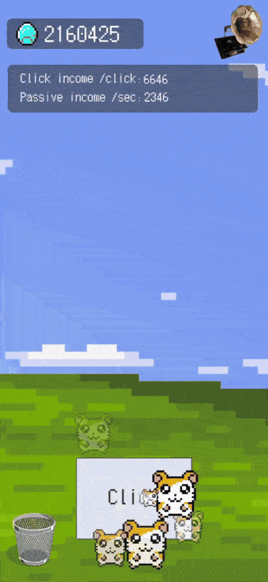
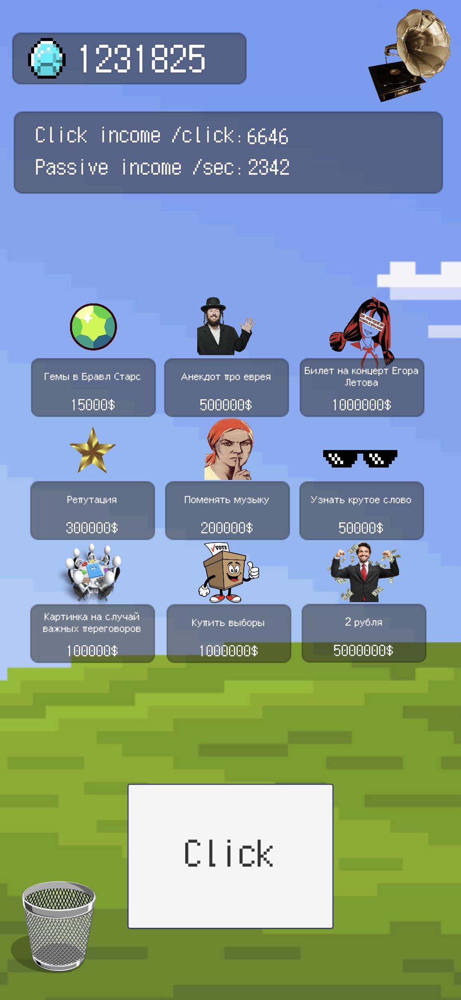
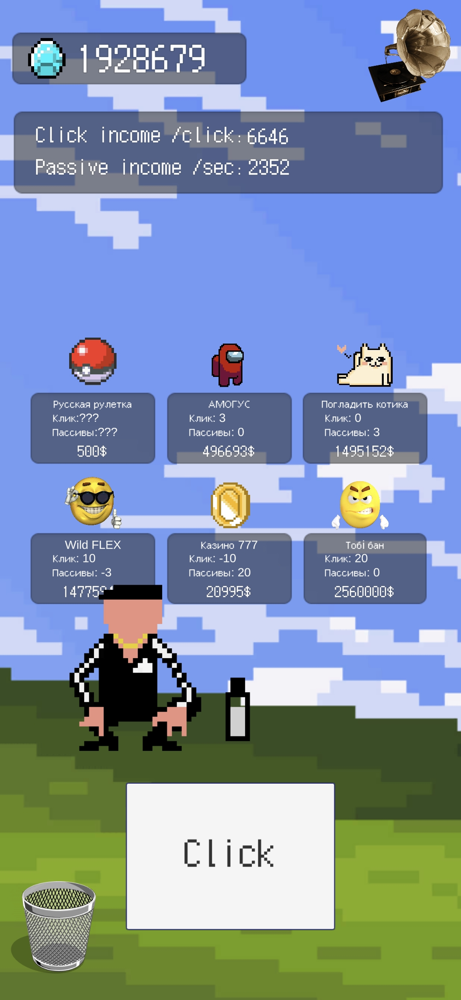
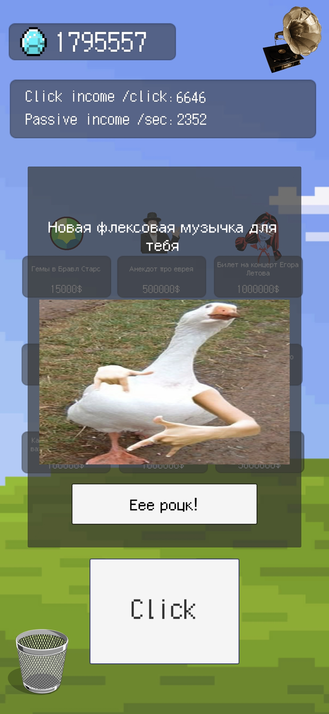

# Deb Click

Genres: Idle, Clicker

**Download:** [DebClick](https://disk.yandex.ru/d/hxfwcIfpmEDHNA)

  

## Description:
A 2D pixel-art clicker made for fun.
The player earns resources by clicking and can buy upgrades whose cost grows as the game progresses.
The player can also buy various fun Extras (for example, changing the music, buying elections, buying a joke and more), which don't directly affect the main progress.
Random events happen during the game: characters appear, and interacting with them triggers various effects.

  
  
  

## Key features:
- Basic clicker mechanic (active and passive income)
- Upgrade system with progressive pricing
- Random event system with various effects
- Drag & drop interaction with random event characters

## Technologies and approaches:
- Component-based architecture (logic in components)
- Event-driven communication between game systems
- ScriptableObjects for data storage (upgrades, extras, random events, player progress)
- Object Pooling for click VFX
- Saving and loading data (JSON serialization and writing to the file system)
- Adaptive UI (support for different portrait screens)
- Passive income mechanic using coroutines
- Random event system (using coroutines and random selection)
- VFX, Particle System and Animator
- Music (changing tracks, on/off)
- Visual design of the project

## Possible improvements:
- Change the swipe mechanic (currently tied to absolute coordinates)
- Separate the logic of random event timing, event type selection and object spawning
- Add pop-up windows to show the effects of random events
- Spawn random event objects through a Pool
- Adapt for landscape orientation
- Add saving/loading of the music setting (on/off)
